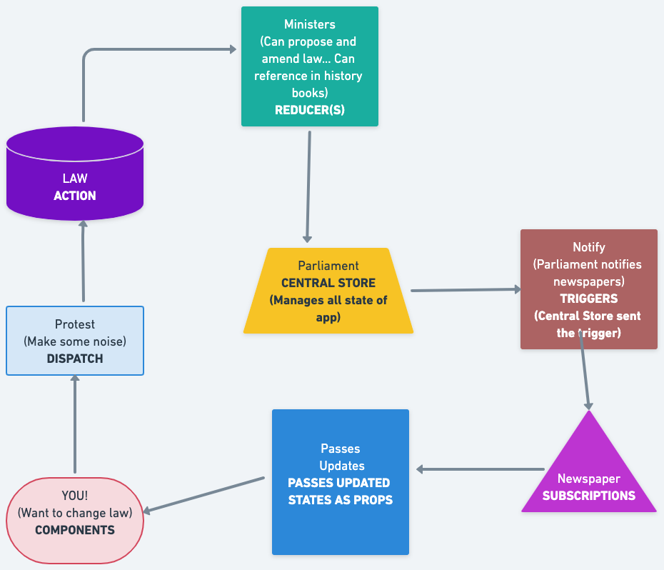

# E-Commerce Site for Charles and Kenneth

### REDUX FLOW

1. Add constants
2. Add Reducer
3. Add Action
4. Implement that action on the screen

### KENJAMIN SHOPPING CART w/REDUX

- [x] Qty Select & Add to Cart Button
- [x] Cart Reducer & Add to Cart Action
- [x] Add to Cart Functionality
- [x] Cart Screen
- [x] Remove Items From Cart

### Back End User Authentication

- [x] Clean up with `controllers`
- [] User Auth `endpoint`
- [] Generate JWT JSON Web Token
- [] Custom Auth Middleware
- [] Token saving in Postman testing
- [] User Registration and Password Encryption

### Front End User Auth with Profile

- [] User Login Reducer and Action
- [] User Login Screen and Functionality
- [] Show User in Navbar and Logout
- [] User Register Reducer, Action and Screen (pages)
- [] Update Profile Endpoint
- [] Profile Screen and Get User Details
- [] Update User Profile
